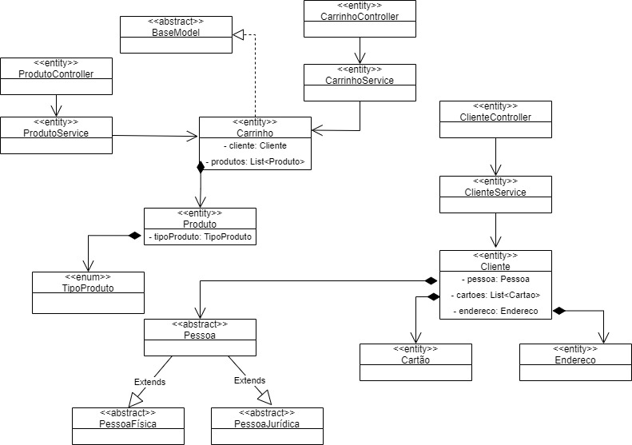

# Relatório da arquitetura

### Model 
 - O cliente pode ser model.PessoaFisica ou model.PessoaJuridica

### Service
- Carrinho
  - Criar um método para listar os itens no carrinho (Produto, Quantidade, Preço Unitário e Total por item)
  - Criar um método para adicionar um item no carrinho.
  - Criar um método para remover um item do carrinho.
  - Criar um método para alterar a quantidade de um item do carrinho.
  - Calcular o total a pagar do carrinho de compras.
  - Prever o desconto no momento de calcular o total da compra.
  - Ao adicionar um novo produto verificar se o produto já existe, se existir atualizar apenas a quantidade.
- Cliente
  - Criar um método para cadastras cartões
  - Criar um método para cadastro de Cliente
  - Criar um método para cadastrar e alterar Endereços

## Controllers
- Controllers para receber as operações
  - para as operações dos produtos
  - para as ações relacionadas ao cliente
  - para as operações do carrinho

## Diagrama de Classes

